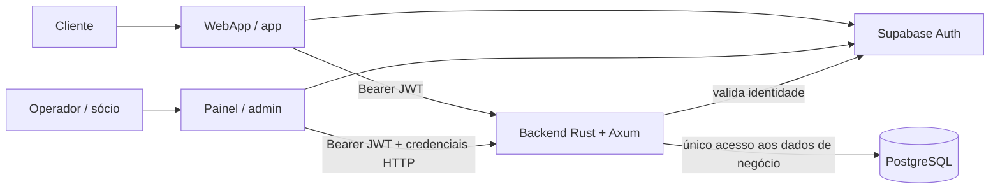
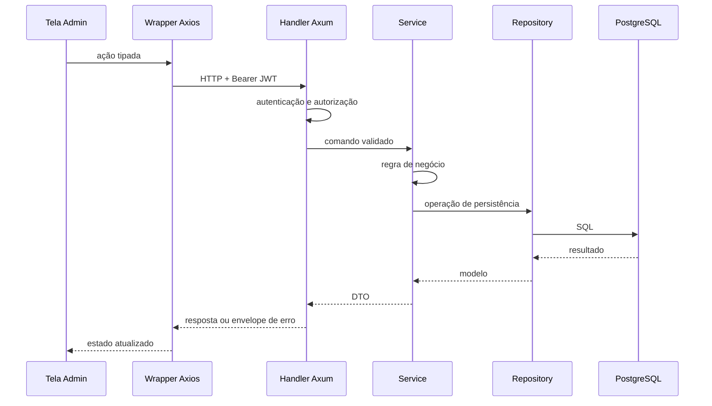
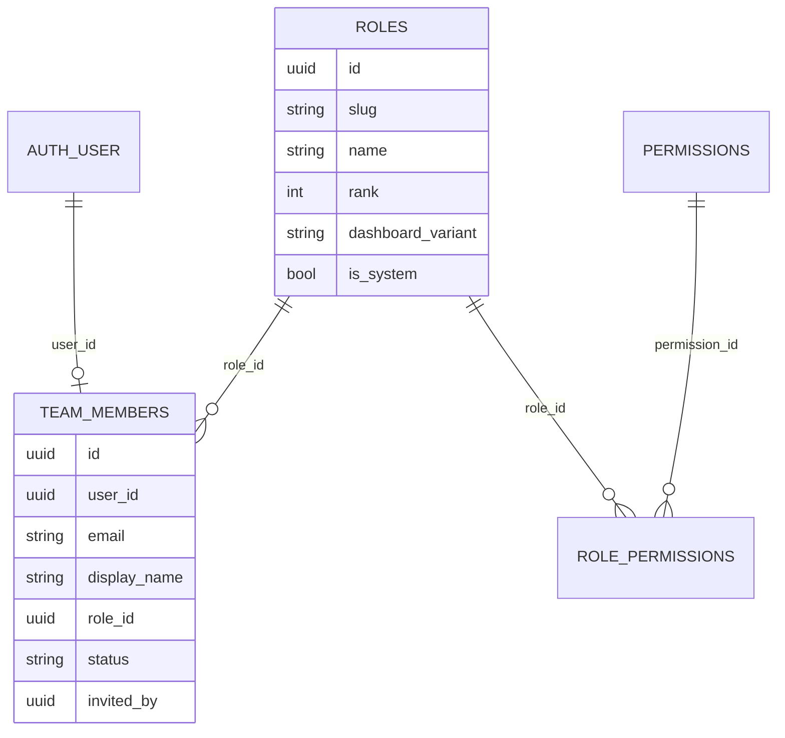

# Transferência de conhecimento — arquitetura do painel administrativo IOCUS

> Documento técnico para reaproveitamento da arquitetura em outro produto.
>
> Base de análise: implementação versionada no repositório IOCUS em 12/09/2026.
> Os exemplos usam nomes genéricos e não contêm credenciais reais.

## 1. Objetivo e resumo executivo

A IOCUS foi organizada como um **monorepo com aplicações independentes** que
compartilham o mesmo backend, o mesmo provedor de identidade e o mesmo banco de
dados, sem misturar a interface administrativa com a interface do cliente.

Os blocos principais são:

| Bloco | Pasta | Tecnologia | Responsabilidade |
|---|---|---|---|
| WebApp do cliente | `app/` | Expo + React Native + React Native Web | Jornada do cliente em web, Android e iOS |
| Painel administrativo | `admin/` | Next.js App Router | Operação, gestão e configuração do negócio |
| API central | `backend/` | Rust + Axum | Regras de negócio, autorização, auditoria e acesso a dados |
| Identidade e persistência | Supabase + `supabase/` | Supabase Auth + PostgreSQL | Autenticação e banco da aplicação |

A separação não é apenas visual. `app/` e `admin/` têm dependências, processo de
build, variáveis de ambiente, rotas de interface e ciclos de implantação
próprios. A convergência ocorre na API:



O princípio essencial para a transferência é:

> Frontends separados; identidade compartilhada; uma única API como fronteira
> de segurança e de regras de negócio.

## 2. Correção de nomenclatura: repositório, projeto Vercel, domínio e site

É importante distinguir quatro conceitos que frequentemente são chamados de
“projeto” na conversa cotidiana:

| Conceito | Significado |
|---|---|
| Repositório Git | O conjunto de código-fonte; na IOCUS contém todas as aplicações |
| Projeto Vercel | Uma unidade de build, configuração, variáveis e deployments |
| Deployment | Uma compilação específica de um projeto Vercel |
| Domínio | Um endereço que aponta para um deployment, como `app.exemplo.com` |

### 2.1. O que está comprovado no repositório IOCUS

O código comprova que existem **duas aplicações frontend independentes no mesmo
repositório**:

- `app/package.json` define a aplicação Expo;
- `app/vercel.json` configura o fallback de SPA para o export web;
- `admin/package.json` define uma aplicação Next.js independente;
- `admin/next.config.ts` configura o build do Admin;
- não existe um `package.json`, `vercel.json` ou orquestrador de build na raiz
  que compile as duas aplicações como um único artefato Vercel;
- não existe `microfrontends.json` nem dependência de
  `@vercel/microfrontends` no estado analisado.

Portanto, **não é correto afirmar, com base no código atual, que a IOCUS produz
dois sites independentes dentro de um único projeto Vercel**. O desenho
reproduzível e coerente com o repositório é:

```text
1 repositório Git
├── 1 projeto Vercel para app/    -> app.exemplo.com
└── 1 projeto Vercel para admin/  -> admin.exemplo.com

Ambos apontam para:
└── 1 backend externo             -> api.exemplo.com
```

Um único projeto Vercel pode ter vários domínios, mas todos eles normalmente
servem o mesmo build. Adicionar dois domínios ao mesmo projeto não faz esse
projeto compilar `app/` e `admin/` como aplicações independentes.

### 2.2. Configuração recomendada na Vercel para replicar a IOCUS

Conecte o mesmo repositório Git duas vezes:

#### Projeto Vercel A — WebApp

| Campo | Valor conceitual |
|---|---|
| Nome do projeto | `<produto>-app` |
| Repositório | o mesmo monorepo |
| Root Directory | `app` |
| Framework/build | Expo Web, conforme a configuração do projeto |
| Domínio | `app.<dominio>` ou o domínio principal |
| API pública | URL do backend compartilhado |
| Supabase | URL e chave publicável do mesmo projeto Supabase |

O `app/vercel.json` atual contém:

```json
{
  "$schema": "https://openapi.vercel.sh/vercel.json",
  "rewrites": [
    { "source": "/(.*)", "destination": "/index.html" }
  ]
}
```

Esse rewrite existe para o roteamento client-side do export web: ao acessar uma
URL profunda diretamente, a Vercel entrega `index.html` e o roteador do app
resolve a tela no navegador.

#### Projeto Vercel B — Admin

| Campo | Valor conceitual |
|---|---|
| Nome do projeto | `<produto>-admin` |
| Repositório | o mesmo monorepo |
| Root Directory | `admin` |
| Framework | Next.js |
| Domínio | `admin.<dominio>` |
| API pública | a mesma URL de backend usada pelo WebApp |
| Supabase | o mesmo projeto de Auth, com chave publicável |

Variáveis públicas esperadas pelo Admin:

```dotenv
NEXT_PUBLIC_SUPABASE_URL=https://<projeto>.supabase.co
NEXT_PUBLIC_SUPABASE_PUBLISHABLE_KEY=<chave-publicavel>
NEXT_PUBLIC_API_URL=https://api.<dominio>
NEXT_PUBLIC_GRAFANA_ERRORS_URL=https://<observabilidade>/...
```

`NEXT_PUBLIC_*` é incorporada ao bundle e **não é segredo**. Chaves privadas,
segredos JWT, tokens do provedor de pagamento e chaves administrativas nunca
devem ser expostos em variáveis públicas de frontend.

### 2.3. Se for obrigatório usar um único domínio por caminhos

Exemplo desejado:

```text
https://produto.com/*        -> WebApp
https://produto.com/admin/*  -> Admin
```

Há duas alternativas arquiteturais:

1. transformar tudo em um único frontend e um único build, o que reduz a
   independência entre WebApp e Admin; ou
2. manter projetos Vercel independentes e agrupá-los como microfrontends, com
   roteamento por caminho.

Na segunda opção, “uma experiência em um domínio” continua significando
**múltiplos projetos Vercel com deployments independentes**, reunidos por um
grupo de microfrontends. A aplicação padrão possui `microfrontends.json`; a
aplicação filha declara caminhos como `/admin/:path*`; cada projeto integra
`@vercel/microfrontends`; e os assets recebem prefixos para não colidirem.

Isso é uma evolução possível, não algo presente hoje na IOCUS. Referência:
[Vercel Microfrontends](https://vercel.com/docs/microfrontends).

Para um painel administrativo, o subdomínio separado (`admin.<dominio>`) tende
a ser mais simples: deixa cookies, políticas de acesso, observabilidade,
deployments e eventual proteção de rede mais explícitos.

## 3. Organização do monorepo

Uma visão reduzida da estrutura é:

```text
iocus/
├── app/                       # produto para o cliente
│   ├── app/                   # rotas Expo Router
│   ├── src/api/               # cliente da API
│   ├── package.json
│   └── vercel.json
├── admin/                     # back-office independente
│   ├── src/api/               # wrappers tipados por módulo do backend
│   ├── src/app/
│   │   ├── (auth)/            # login, callback, acesso negado
│   │   └── (dashboard)/       # shell autenticado e telas de operação
│   ├── src/components/
│   │   ├── layout/
│   │   └── ui/
│   ├── src/hooks/
│   ├── src/lib/
│   ├── package.json
│   └── next.config.ts
├── backend/                   # API central e modular
│   └── src/modules/
├── supabase/
│   └── migrations/            # schema versionado e seeds estruturais
└── docs/                      # contratos e documentação transversal
```

### 3.1. Por que não colocar o Admin dentro do WebApp

Separar o Admin em `admin/` produz isolamento em vários níveis:

- dependências de Next.js e componentes administrativos não entram no bundle
  do cliente;
- a equipe pode fazer deploy do Admin sem recompilar ou publicar o aplicativo
  móvel;
- falha de build em um frontend não precisa impedir o deploy do outro;
- rotas internas não se confundem com rotas públicas;
- variáveis e integrações administrativas podem ter configuração própria;
- regras de cache, SSR e otimização podem divergir;
- controles de acesso adicionais podem ser aplicados ao domínio administrativo.

O compartilhamento não acontece importando arquivos entre `app/` e `admin/`.
Ele acontece por **contratos HTTP do backend**. Isso reduz acoplamento de build
e evita que um frontend se torne dependência de implementação do outro.

### 3.2. Camadas internas do Admin

O Admin usa uma separação de responsabilidades simples:

```text
Página/componente
      ↓
Hook de dados ou de autorização
      ↓
Wrapper tipado em admin/src/api/<modulo>.ts
      ↓
Instância Axios compartilhada em admin/src/lib/api.ts
      ↓
Backend /api/v1/<modulo>/...
```

Páginas, componentes e hooks não devem escrever URLs de API diretamente. Cada
módulo possui funções assíncronas tipadas em `admin/src/api/`, por exemplo:

- `admin.ts` — identidade administrativa básica;
- `team.ts` — usuário atual, papéis, permissões e membros;
- `tickets.ts` — catálogo de ingressos;
- `bookings.ts` — sessões;
- `checkins.ts` — check-ins;
- `settings.ts` — configurações da empresa;
- `audit.ts` — trilha de auditoria;
- `restaurants.ts` — parceiros e regras de restaurantes.

Essa camada é o adaptador do frontend para o contrato HTTP. Quando uma rota,
payload ou resposta muda, o ponto natural de atualização é o wrapper do módulo,
e não dezenas de componentes.

## 4. Como os dois frontends usam o mesmo backend

O Admin cria uma instância Axios com `baseURL` em `NEXT_PUBLIC_API_URL`. Antes de
cada requisição, um interceptor consulta a sessão do Supabase e, se houver token,
adiciona:

```http
Authorization: Bearer <access_token>
```

O WebApp segue a mesma ideia: autentica no Supabase e envia o JWT ao backend.
O backend valida a identidade e decide o que aquele usuário pode fazer.

Nenhum frontend acessa tabelas de negócio diretamente pelo cliente de dados do
Supabase. Na arquitetura IOCUS, Supabase no frontend é usado para
**autenticação**; leituras e escritas de negócio passam pelo backend. Isso evita
dois sistemas de autorização concorrentes e concentra regras, validações,
auditoria e observabilidade.

### 4.1. CORS para domínios separados

Como Admin, WebApp e API podem estar em origens diferentes, o backend precisa
autorizar explicitamente as origens de produção:

```dotenv
CORS_ALLOWED_ORIGINS=https://app.<dominio>,https://admin.<dominio>
```

Na IOCUS:

- produção falha ao iniciar se a lista estiver vazia;
- apenas as origens configuradas são refletidas;
- credenciais HTTP são permitidas;
- desenvolvimento reflete a origem recebida para suportar as portas locais.

O Admin configura `withCredentials: true` no Axios. Isso é necessário para que
o navegador aceite e envie cookies HTTP-only emitidos pelo backend. Com
credenciais habilitadas, `Access-Control-Allow-Origin: *` não é válido; o
backend deve devolver uma origem específica.

### 4.2. Ambientes devem apontar para o mesmo conjunto de serviços

Para cada ambiente, as três peças precisam ser coerentes:

| Ambiente | WebApp | Admin | Backend/Supabase |
|---|---|---|---|
| Preview | preview do app | preview do admin | serviços de homologação |
| Produção | domínio público | domínio administrativo | serviços de produção |

Misturar Admin de preview com banco de produção é especialmente perigoso,
porque o Admin possui operações destrutivas. A URL da API e o projeto Supabase
devem ser revisados por ambiente.

## 5. Arquitetura de rotas da API

O backend é um monólito modular em Rust/Axum. “Monólito” significa um único
processo/deployment; “modular” significa que cada domínio mantém contrato,
handlers, serviço, repositório, modelos, DTOs, erros, métricas e documentação.

Cada módulo exporta construtores de rotas de leitura e escrita:

```text
<modulo>_read_routes()
<modulo>_write_routes()
```

O roteador central, em `backend/src/modules/web/router.rs`, compõe os módulos
sob o prefixo versionado:

```text
/api/v1/{modulo}/{recurso}
```

Exemplos:

```text
GET    /api/v1/admin/me
GET    /api/v1/team/me
GET    /api/v1/team/permissions
GET    /api/v1/team/roles
POST   /api/v1/team/roles
PUT    /api/v1/team/roles/{id}
DELETE /api/v1/team/roles/{id}
GET    /api/v1/team/members
POST   /api/v1/team/members
PUT    /api/v1/team/members/{id}
PUT    /api/v1/team/members/{id}/status
DELETE /api/v1/team/members/{id}
```

O roteador também agrupa tráfego por escopo de rate limit. Leituras comuns,
escritas, autenticação, webhooks e operações administrativas não compartilham
necessariamente o mesmo limite.

### 5.1. O que significa “o Admin edita o sistema”

O Admin **não cria, apaga ou altera definições de rotas HTTP em tempo de
execução**. Rotas são código versionado, revisado, testado e implantado.

O Admin edita o comportamento do produto por meio de recursos controlados:

- registros de negócio, como ingressos, sessões e restaurantes;
- configurações persistidas, como dados da empresa e documentos legais;
- usuários da equipe;
- papéis e associações de permissões;
- estados operacionais, como ativar/desativar um membro;
- regras expostas deliberadamente por endpoints administrativos.

Essa distinção protege o sistema. Se uma interface pudesse modificar o próprio
roteamento ou código do backend, um erro operacional poderia remover guardas de
autorização, expor endpoints ou tornar a API indisponível.

O padrão correto para tornar uma nova parte do sistema administrável é:

1. definir o contrato e a regra de autorização;
2. criar ou ampliar o módulo no backend;
3. registrar as novas permissões necessárias;
4. expor endpoints fixos e validados;
5. criar wrappers tipados no Admin;
6. construir a tela e seus estados de carregamento/erro;
7. proteger a ação no backend e, por conveniência, também na interface;
8. auditar mutações sensíveis.

### 5.2. Handler, serviço e repositório

O fluxo de uma ação administrativa segue esta direção:



- **Handler:** interpreta HTTP, autentica, autoriza e chama o serviço.
- **Service:** aplica regras de negócio e coordena operações.
- **Repository:** é o único local do módulo com SQL de domínio.
- **DTO:** define o formato público da requisição/resposta.

O frontend nunca deve ser a única barreira. Esconder um botão ou menu melhora a
experiência, mas qualquer pessoa pode chamar uma URL manualmente. A recusa real
precisa ocorrer no handler/serviço do backend.

## 6. Autenticação administrativa

A identidade continua no Supabase Auth. O backend não mantém uma segunda senha
na tabela `team_members`.

O fluxo atual do Admin é:

1. a pessoa envia e-mail e senha para `POST /api/v1/auth/admin-login`;
2. o backend valida as credenciais usando o provedor de identidade;
3. o backend devolve tokens de sessão Supabase;
4. o navegador instala a sessão com `supabase.auth.setSession`;
5. o backend também emite o cookie HTTP-only administrativo;
6. a tela de callback chama `GET /api/v1/admin/me`;
7. somente uma identidade reconhecida como equipe entra no dashboard.

O `GET /api/v1/admin/me` retorna identidade e papel básico. Uma sessão válida de
cliente comum recebe `403 FORBIDDEN`; ausência ou expiração de sessão recebe
`401`.

O cookie administrativo adicional é enviado com `withCredentials: true`. No
roteador analisado, a verificação desse cookie envolve especificamente a
subárvore `/api/v1/admin/*`; as demais subárvores continuam protegidas pelo JWT
e por suas próprias guardas de papel/permissão. Se o outro projeto quiser exigir
essa prova adicional em **todas** as operações de back-office, deve compor o
middleware ao redor de todas as subárvores administrativas, não apenas
`/admin`.

## 7. Autorização: papel não é permissão

A arquitetura evoluiu de três strings fixas para RBAC configurável.

### 7.1. Vocabulário inicial

Os papéis de sistema são:

```typescript
type AdminRole = 'staff' | 'admin' | 'super_admin';
```

No token Supabase, o slug do papel fica em:

```text
app_metadata.role
```

Isso é intencional. `app_metadata` é controlado pelo servidor; não se deve
autorizar usando `user_metadata`, que pertence ao perfil editável do usuário.

### 7.2. Modelo de dados RBAC

A migração `20260819110000_add_team.sql` cria:

| Tabela | Função |
|---|---|
| `permissions` | Registro fechado de capacidades, como `team.manage_users` |
| `roles` | Papéis do sistema e papéis customizados |
| `role_permissions` | Relação muitos-para-muitos entre papel e permissão |
| `team_members` | Perfil administrativo ligado ao usuário do Supabase Auth |

Relações principais:



O `user_id` liga a conta à identidade do Supabase. A tabela local acrescenta o
que o provedor de identidade não deve modelar sozinho: papel configurável,
status operacional, nome exibido e autoria do convite.

### 7.3. Usuário atual e permissões resolvidas

O endpoint mais rico é:

```http
GET /api/v1/team/me
```

Ele devolve o papel resolvido, o conjunto de permissões e a variante do
dashboard. O Admin consome isso em `useCurrentTeamMember` e verifica capacidades
com `useHasPermission` ou `useRequirePermission`.

Exemplo conceitual:

```json
{
  "user_id": "<uuid>",
  "display_name": "Sócio",
  "role": {
    "slug": "admin",
    "rank": 50,
    "dashboard_variant": "gestao"
  },
  "permissions": [
    "tickets.manage",
    "finance.view",
    "team.manage_users"
  ],
  "status": "active"
}
```

O menu lateral filtra entradas por permissão, não por uma lista fixa de nomes
de papel. Assim, um papel customizado que receba `finance.view` passa a ver a
tela financeira mesmo que seu slug não seja `admin`.

### 7.4. Três camadas de proteção

Uma operação sensível deve ser protegida em três lugares:

1. **navegação:** não mostrar o item sem a permissão;
2. **página:** impedir carregamento e ações quando a URL for digitada
   diretamente;
3. **backend:** rejeitar a requisição sem a permissão correta.

As duas primeiras são experiência do usuário. A terceira é a fronteira de
segurança.

Há uma transição histórica ainda visível na IOCUS: telas mais antigas usam
`useRequireRole` ou endpoints protegidos apenas por `is_staff()`, enquanto as
mais novas usam permissões específicas. Ao transferir a arquitetura, prefira
permissões para toda nova capacidade e migre gradualmente as guardas genéricas.

## 8. Modelo recomendado para Dev, sócios e equipe

Para o novo projeto, o desenho pedido pode ser expresso assim:

| Perfil | Papel recomendado | Uso | Restrições esperadas |
|---|---|---|---|
| Desenvolvedor responsável | `super_admin` | Configuração estrutural, papéis, auditoria e recuperação | Conta nominal, uso raro, MFA/proteção reforçada |
| Sócios | `admin` | Gestão comercial e operacional, equipe e relatórios | Sem elevar privilégios até `super_admin`; sem segredos técnicos |
| Colaboradores | `staff` ou papel customizado | Rotinas específicas | Princípio do menor privilégio |

### 8.1. `super_admin` para o desenvolvedor

O papel de topo é um papel de recuperação e governança, não um usuário genérico
compartilhado. Recomendações:

- uma conta nominal por desenvolvedor autorizado;
- nenhuma conta como `dev@...` compartilhada por várias pessoas;
- autenticação reforçada;
- auditoria de todas as ações críticas;
- uso apenas quando uma permissão de topo for realmente necessária;
- ao menos duas contas de recuperação controladas, se a continuidade do negócio
  exigir que o sistema não dependa de uma única pessoa;
- proibição de o último `super_admin` ser desativado ou excluído.

A IOCUS protege o último super-admin e impede autoexclusão/autodesativação em
operações relevantes. Também usa `rank` para bloquear escalada lateral ou para
cima.

### 8.2. `admin` para os sócios

O papel dos sócios deve representar capacidades de negócio, por exemplo:

- consultar resultados;
- administrar catálogo e agenda;
- gerir usuários abaixo de seu nível;
- operar configurações comerciais;
- visualizar auditoria, se essa for uma decisão do produto.

Não é recomendável conceder automaticamente:

- edição de papéis com poder igual ou superior;
- leitura de segredos de integração;
- alteração de configuração de infraestrutura;
- criação de outro `super_admin`;
- desativação de pares ou superiores sem uma decisão explícita.

### 8.3. Regra de rank contra escalada

Na IOCUS, papéis possuem um número crescente de privilégio:

```text
staff       = 10
admin       = 50
super_admin = 100
```

Como regra geral, um usuário só pode criar ou atribuir um papel de rank
**estritamente menor** que o próprio. Isso evita que um `admin`:

- crie outro papel equivalente ao seu para contornar restrições;
- crie um papel superior;
- promova alguém a `super_admin`;
- edite um superior.

O `super_admin` possui uma exceção controlada para administrar membros, mas não
para criar papéis acima do teto. Proteções de último super-admin e de ação sobre
a própria conta continuam válidas.

### 8.4. Dashboard por perfil

Cada papel aponta para uma variante de dashboard definida em código:

```text
operacional
gestao
administracao
```

Isso não significa manter três aplicações. São três composições de uma mesma
home administrativa:

- operacional destaca execução diária;
- gestão destaca indicadores e ações dos sócios;
- administração destaca governança do sistema.

As ações rápidas de cada dashboard continuam filtradas por permissão. A variante
organiza a informação; ela não concede acesso.

## 9. Provisionamento e ciclo de vida de contas administrativas

O módulo `team` centraliza:

- listar membros;
- criar a conta de equipe;
- alterar nome, e-mail, senha e papel;
- ativar ou desativar;
- excluir, respeitando proteções;
- listar/criar/editar/excluir papéis customizados;
- atribuir permissões a papéis.

Ao criar uma pessoa da equipe, o backend:

1. valida se o operador possui `team.manage_users`;
2. aplica a regra de rank;
3. cria a identidade pelo Supabase Admin API;
4. grava `app_metadata.role` no servidor;
5. cria o perfil em `team_members`;
6. registra auditoria e dispara a comunicação prevista.

O frontend não recebe uma chave administrativa do Supabase. Operações
privilegiadas contra o provedor de identidade acontecem apenas no backend.

Desativar um membro deve afetar a autorização no backend mesmo se ainda existir
um JWT não expirado. Se for necessária revogação imediata de todas as sessões,
ela deve ser desenhada explicitamente; apenas mudar o registro local não invalida
automaticamente todo token já emitido.

## 10. Registro de permissões

As chaves seguem `modulo.acao`, em `snake_case`. Exemplos existentes incluem:

```text
tickets.manage
checkins.manage
sales.view
bookings.manage
team.manage_users
team.manage_roles
pos.sell
participants.view
customers.manage
finance.view
support.manage
audit.view
audit.export
restaurants.view
restaurants.manage
```

O registro humano está em `docs/cross-cutting/Permissions.md`; o registro de
runtime é criado por migrations. A interface pode selecionar permissões
existentes para um papel, mas não inventar chaves arbitrárias.

Para acrescentar uma permissão no projeto transferido:

1. documentar a chave, o significado e o endpoint que a exigirá;
2. adicionar a permissão por migration append-only;
3. aplicar a guarda no backend;
4. conceder a chave aos papéis de sistema apropriados;
5. usar a mesma chave no menu e no guard da página;
6. criar testes de permitido e negado.

Uma permissão sem guarda no backend é apenas decoração. Uma guarda sem registro
e sem concessão deixa a funcionalidade inacessível.

## 11. Auditoria e operações destrutivas

Gerenciar o próprio sistema exige rastreabilidade. A IOCUS possui um módulo de
auditoria append-only e registra mutações do módulo de equipe, incluindo
alterações de papel, permissões, estado e tentativas de escalada recusadas.

Uma trilha útil deve responder:

- quem executou;
- quando, sempre em UTC;
- qual ação;
- sobre qual entidade;
- qual permissão autorizou a ação;
- quais campos mudaram, sem registrar segredos ou PII desnecessária;
- qual foi o resultado;
- qual `request_id` permite correlacionar logs e requisição.

A interface deve exigir confirmação para ações destrutivas e, quando
apropriado, capturar um motivo. A auditoria não substitui autorização; ela
explica o que aconteceu depois que a autorização foi aplicada.

## 12. Contratos de erro e comportamento do frontend

Toda resposta `4xx` ou `5xx` segue um envelope comum:

```json
{
  "error": {
    "code": "FORBIDDEN",
    "message": "...",
    "details": {},
    "request_id": "..."
  }
}
```

O Admin traduz códigos conhecidos para mensagens em pt-BR. O interceptor trata
`401` como sessão inválida e força novo login; `403` representa sessão válida
sem capacidade suficiente; `429` deve considerar a indicação de nova tentativa.

Manter códigos estáveis é mais importante do que fazer o frontend interpretar o
texto do backend. Texto pode mudar; o código é parte do contrato.

## 13. Como adicionar uma nova área administrável

Exemplo: permitir que os sócios administrem “unidades”.

### Backend e dados

1. definir `units.view` e `units.manage`;
2. registrar as chaves na documentação e em uma nova migration;
3. criar a tabela `units` e seus índices/constraints;
4. criar o módulo `backend/src/modules/units/`;
5. expor rotas sob `/api/v1/units`;
6. proteger leituras e mutações com a permissão correspondente;
7. registrar mutações na auditoria;
8. adicionar o módulo ao roteador central;
9. testar autenticação, permissão, validação e persistência.

### Admin

1. criar `admin/src/api/units.ts` com DTOs e funções tipadas;
2. criar hooks TanStack Query;
3. criar páginas em `admin/src/app/(dashboard)/units/`;
4. adicionar o item de menu com `permission: 'units.view'`;
5. proteger a página com `useRequirePermission('units.view')`;
6. esconder/desabilitar mutações sem `units.manage`;
7. invalidar query keys após sucesso;
8. renderizar estados de carregamento, vazio, erro e acesso negado;
9. mapear novos códigos de erro para pt-BR;
10. executar os testes e typecheck.

### WebApp

O WebApp só muda se clientes consumirem unidades. Ele aponta para o mesmo
backend, mas recebe apenas os endpoints públicos/autorizados para clientes. A
existência de uma tela administrativa não dá ao WebApp acesso às mutações.

## 14. Segurança: checklist mínimo para a transferência

- [ ] Admin e WebApp usam builds e variáveis independentes.
- [ ] Chaves administrativas nunca aparecem em `NEXT_PUBLIC_*` ou
  `EXPO_PUBLIC_*`.
- [ ] Supabase no frontend é usado apenas para autenticação.
- [ ] Toda operação de negócio passa pelo backend.
- [ ] O backend lê o papel de `app_metadata`, nunca de `user_metadata`.
- [ ] Toda tela sensível possui guarda de página.
- [ ] Todo endpoint sensível possui guarda server-side.
- [ ] O menu é filtrado por permissão, não apenas por nome do papel.
- [ ] Um `admin` não consegue criar ou atribuir um papel de rank igual ou maior.
- [ ] O último `super_admin` não pode ser removido.
- [ ] Contas de super-admin são nominais, não compartilhadas.
- [ ] Produção possui CORS explícito para WebApp e Admin.
- [ ] Cookies administrativos usam `Secure`, `HttpOnly` e política `SameSite`
  compatível com os domínios escolhidos.
- [ ] Mutações críticas geram eventos de auditoria.
- [ ] Logs não contêm senha, token, e-mail completo, telefone ou IP bruto.
- [ ] Valores monetários cruzam a API como centavos inteiros.
- [ ] Timestamps cruzam a API em UTC.
- [ ] Erros possuem código estável e `request_id`.
- [ ] Preview não aponta acidentalmente para dados de produção.

## 15. Estratégia de implantação sugerida no novo projeto

### Fase 1 — fundação

- criar monorepo com `app/`, `admin/`, `backend/` e `supabase/`;
- criar um projeto Vercel para cada frontend, ambos ligados ao mesmo Git;
- implantar o backend em endereço próprio;
- configurar Supabase Auth e migrations;
- configurar CORS para os dois domínios.

### Fase 2 — autenticação e papel de topo

- criar o primeiro `super_admin` por processo operacional seguro;
- implementar `/auth/admin-login`, `/admin/me` e `/team/me`;
- bloquear qualquer usuário autenticado que não pertença à equipe;
- implementar proteção do último super-admin.

### Fase 3 — RBAC

- criar tabelas de papéis, permissões e membros;
- semear `staff`, `admin` e `super_admin`;
- implementar rank e guardas por permissão;
- migrar menu e páginas para permissões resolvidas.

### Fase 4 — módulos administráveis

- introduzir cada domínio verticalmente: migration, API, autorização, wrapper,
  tela e testes;
- não criar primeiro uma “tela genérica que edita tudo”;
- manter ações de infraestrutura fora do painel dos sócios.

### Fase 5 — auditoria e endurecimento

- auditar mutações e recusas relevantes;
- proteger o domínio Admin com controles adicionais, se necessário;
- revisar expiração/revogação de sessões;
- testar CORS, cookies e redirects em preview e produção;
- criar alertas para falhas de login, escalada negada e mudanças de papel.

## 16. Decisões que devem ser tomadas no projeto de destino

Antes de copiar código, o novo produto precisa responder:

1. WebApp e Admin usarão subdomínios ou caminhos do mesmo domínio?
2. Haverá dois projetos Vercel independentes ou um grupo de microfrontends?
3. Quais ações comerciais os sócios podem executar?
4. Quais ações ficam exclusivamente com desenvolvedores?
5. Sócios podem convidar outros sócios ou apenas colaboradores inferiores?
6. Quem pode visualizar e exportar auditoria?
7. Quais módulos ainda aceitam “qualquer staff” e quais exigem permissão fina?
8. Desativação precisa revogar sessões imediatamente?
9. Quais operações exigem confirmação, motivo e dupla aprovação?
10. Qual é o procedimento de recuperação se o desenvolvedor perder acesso?

Essas respostas viram papéis, permissões, regras de rank, guardas de endpoint e
procedimentos operacionais. Não devem existir apenas como uma combinação de
itens escondidos no menu.

## 17. Pontos do estado atual que não devem ser copiados cegamente

A análise encontrou alguns sinais de evolução incremental. Eles não anulam a
arquitetura, mas precisam ser resolvidos ou conscientemente aceitos no projeto
de destino:

1. **Topologia Vercel não está versionada por completo.** O código define os
   dois builds, mas arquivos locais `.vercel/project.json` não estão no
   repositório. O dashboard da conta é necessário para provar nomes de projetos,
   domínios e variáveis efetivamente publicados.
2. **RBAC está em migração.** Módulos novos possuem guardas por permissão;
   alguns módulos antigos ainda aceitam qualquer papel reconhecido por
   `is_staff()`. Não presuma que uma chave exibida no Admin já seja aplicada por
   todos os endpoints daquele domínio.
3. **O registro humano de permissões possui drift.** O arquivo
   `docs/cross-cutting/Permissions.md` contém as chaves iniciais e algumas
   adições posteriores, mas, no estado analisado, não lista todas as chaves das
   migrations de 26/08, como `pos.sell`, `participants.view`,
   `customers.manage`, `finance.view` e `support.manage`; sua tabela de grants
   padrão também antecede remapeamentos posteriores. Antes de reutilizar a
   matriz, reconcilie documentação, migrations, backend e sidebar.
4. **A prova administrativa adicional tem escopo estreito.** O middleware do
   cookie envolve `/api/v1/admin/*`, mas `team`, `audit` e outras subárvores têm
   composição separada. Se a intenção de produto for “todo back-office exige a
   prova adicional”, amplie o escopo e teste cada subárvore.
5. **Há duas fontes de identidade do usuário atual durante a transição.** O
   hook antigo consome `/admin/me` e conhece o papel plano; o hook moderno
   consome `/team/me` e conhece permissões e variante do dashboard. Para o novo
   projeto, use `/team/me` como contexto principal e mantenha um endpoint mínimo
   separado apenas se houver uma razão explícita.
6. **Nomes históricos podem enganar.** O cookie ainda se chama
   `iocus_admin_2fa`, embora o fluxo atual de tela seja e-mail + senha em um
   único passo. O nome técnico não deve ser usado como evidência de MFA real.

Esses pontos são também um bom roteiro de revisão antes de apresentar a
arquitetura como modelo definitivo.

## 18. Arquivos de referência na IOCUS

| Tema | Arquivo |
|---|---|
| Regras do Admin | `admin/AGENTS.md` |
| Estrutura e deploy do Admin | `admin/README.md` |
| Configuração Next.js | `admin/next.config.ts` |
| Variáveis públicas do Admin | `admin/.env.example` |
| Cliente HTTP e bearer token | `admin/src/lib/api.ts` |
| Cliente Supabase | `admin/src/lib/supabase.ts` |
| Login administrativo | `admin/src/app/(auth)/login/page.tsx` |
| Identidade administrativa básica | `admin/src/hooks/useCurrentAdmin.ts` |
| Permissões resolvidas | `admin/src/hooks/useTeam.ts` |
| Navegação por permissão | `admin/src/components/layout/sidebar.tsx` |
| Contrato do módulo Admin | `backend/src/modules/admin/SPEC.md` |
| Contrato RBAC | `backend/src/modules/team/SPEC.md` |
| Composição das rotas | `backend/src/modules/web/router.rs` |
| Registro de permissões | `docs/cross-cutting/Permissions.md` |
| Schema inicial de RBAC | `supabase/migrations/20260819110000_add_team.sql` |
| Configuração web do app | `app/vercel.json` |

## 19. Conclusão

O valor transferível da arquitetura IOCUS não é “ter duas URLs”. É manter
fronteiras claras:

- um monorepo para governança e evolução coordenada;
- frontends independentes para públicos diferentes;
- projetos/deployments independentes quando os builds são diferentes;
- um backend central como autoridade sobre dados e regras;
- um único provedor de identidade;
- autorização por permissão no servidor;
- papéis com rank para impedir escalada;
- super-admin reservado à governança técnica;
- Admin dos sócios limitado a capacidades de negócio explícitas;
- toda mudança crítica rastreável por auditoria.

Copiando essas fronteiras — e não apenas as pastas — o novo projeto preserva o
que torna o painel administrável sem torná-lo capaz de contornar a própria
segurança.
